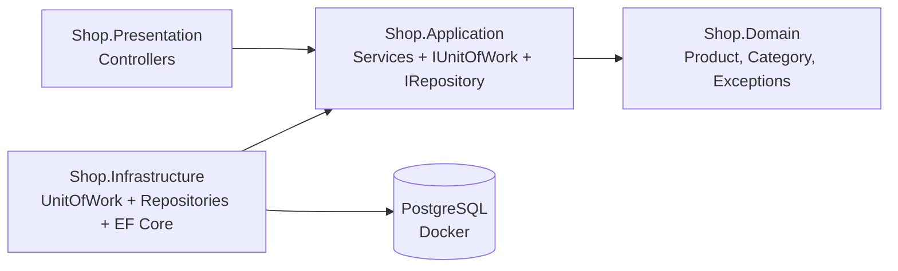

# Clean Architecture + Unit of Work + Repository Pattern

Learning repo: **3 patterns**, explained, then used together in one runnable .NET 10 demo (`Shop.Demo`).



## Read in order
| # | Doc | One-line idea |
|---|---|---|
| 1 | [Repository Pattern](docs/01-repository-pattern.md) | Data access looks like a **collection**. Queries live in one place. |
| 2 | [Unit of Work](docs/02-unit-of-work.md) | Many repository changes, **one commit**. |
| 3 | [Clean Architecture](docs/03-clean-architecture.md) | Dependencies point **inward**. The core knows no DB or framework. |
| 4 | [Putting It Together](docs/04-putting-it-together.md) | One HTTP request traced through every layer. |
| 5 | [Error Handling](docs/05-error-handling.md) | Throw Domain exceptions anywhere; **one middleware** maps them to HTTP. |

Each doc: **Definition → Example → Benefits → Anti-patterns**.

## Shop.Demo features
| Endpoint | What it shows |
|---|---|
| `GET/POST/PUT/DELETE /api/v1.0/products` | Product CRUD through `IUnitOfWork.Products` |
| `GET/POST/PUT/DELETE /api/v1.0/categories` | Category CRUD through `IUnitOfWork.Categories` |
| `DELETE /api/v1.0/categories/{id}?moveTo={id}` | **Unit of Work showcase**: move products + delete category inside `unitOfWork.Transaction(...)` |

## Run
Requirements: .NET 10 SDK, Docker.

```bash
cd Shop.Demo
docker compose up -d              # PostgreSQL on localhost:5432 (shop / shop123 / shopdb)
dotnet run --project Shop.Presentation   # http://localhost:5153  (creates schema + seed data on start)
```
Then open `Shop.Presentation/Shop.Presentation.http` in VS Code (REST Client) or Rider and send the requests.

```bash
curl http://localhost:5153/api/v1.0/products
curl -X DELETE "http://localhost:5153/api/v1.0/categories/1?moveTo=2"
```

> Docker installed via **snap** can't read files on removable drives (`/run/media/...`). Workaround:
> `docker compose -p shopdemo -f - up -d < docker-compose.yml`

Seed data: categories `Electronics`, `Books`; products `Laptop`, `Phone`, `Clean Architecture (book)`.

Reset the DB: `docker compose down -v`

## Structure
The project follows the layout of a production Clean Architecture template, trimmed to what the 3 patterns need.
JWT, Swagger auth, rate limiting, `.resx` localization, FluentValidation and migrations are left out on purpose.
