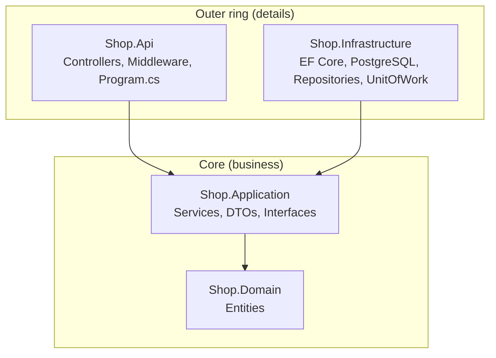
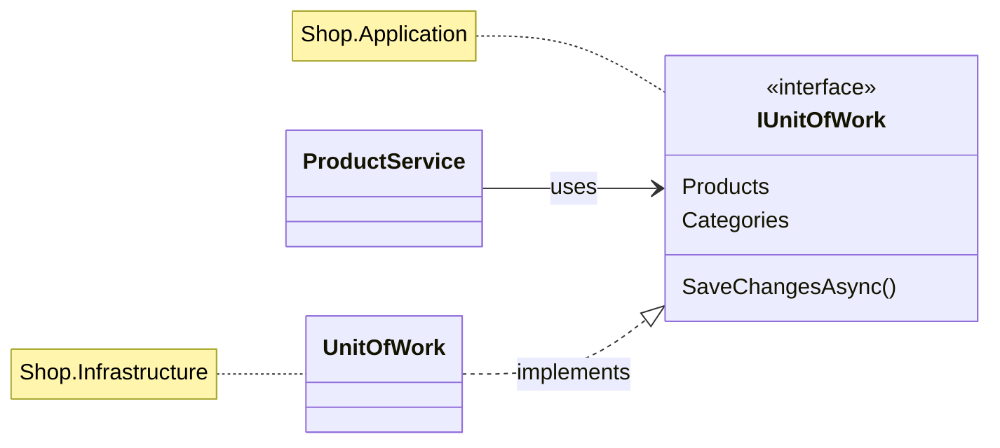

# 1. Clean Architecture

## Definition
Organize the app into **layers (rings)** where **dependencies point inward only**.
The business core (Domain + Application) knows nothing about databases, frameworks, or HTTP.



| Layer | Contains | References |
|---|---|---|
| `Shop.Domain` | `Product`, `Category` | nothing |
| `Shop.Application` | `ProductService`, `IUnitOfWork`, `IProductRepository`, DTOs | Domain |
| `Shop.Infrastructure` | `AppDbContext`, `ProductRepository`, `UnitOfWork` | Application |
| `Shop.Api` | `ProductsController`, `ErrorHandlingMiddleware` | Application + Infrastructure (DI only) |

### The trick: Dependency Inversion
Application **defines** the interface. Infrastructure **implements** it.



## Example

`Shop.Application/Services/ProductService.cs`: no `using Microsoft.EntityFrameworkCore`, no `Npgsql`:
```csharp
public class ProductService(IUnitOfWork unitOfWork)
{
    public async Task<int> CreateAsync(CreateProductRequest request, CancellationToken ct)
    {
        await unitOfWork.Categories.EnsureExistsAsync(request.CategoryId, ct);

        var product = new Product { Name = request.Name, Price = request.Price, ... };

        await unitOfWork.Products.AddAsync(product, ct);
        await unitOfWork.SaveChangesAsync(ct);
        return product.Id;
    }
}
```

`Shop.Api/Program.cs`, the **composition root** (the only place that knows every layer):
```csharp
builder.Services.AddApplication();                                   // services
builder.Services.AddInfrastructure(connectionString);                // EF Core + UoW
```

The compiler enforces the rule:
```xml
<!-- Shop.Application.csproj : can only see Domain -->
<ProjectReference Include="..\Shop.Domain\Shop.Domain.csproj" />
```
If Application tries to use `AppDbContext`, it **fails to compile**.

## Benefits
| Benefit | Concrete case in Shop.Demo |
|---|---|
| Swap the database | PostgreSQL → SQL Server: change **1 line** in `Infrastructure/DependencyInjection.cs` (`UseNpgsql` → `UseSqlServer`). Services stay untouched. |
| Testable core | `ProductService` can be tested with a fake `IUnitOfWork`, with no Docker or DB. |
| Thin controllers | `ProductsController` is 5 one-line actions. All rules live in services. |
| Clear place for everything | New rule → Application. New table → Domain + Infrastructure. New endpoint → Api. |
| Framework independence | Domain entities are plain C# classes, so they survive any framework upgrade. |
