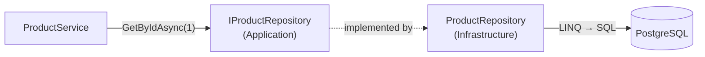
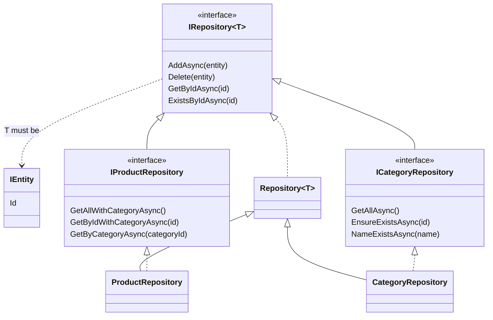
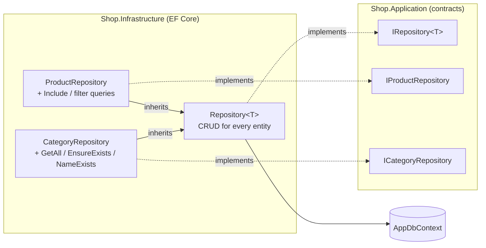

# 1. Repository Pattern

## Definition
A **repository** acts like an **in-memory collection of entities** (`Add`, `Delete`, `GetById`) and hides *how* data is stored.
Services talk to `IProductRepository`, never to `DbContext` or SQL.



### Generic + specific


## Example

**Entity base** (`Shop.Domain/Entities/IEntity.cs`): gives every entity an `Id`, so a generic repository can query by it.
```csharp
public class IEntity
{
    public int Id { get; set; }
}

public class Product : IEntity { ... }
public class Category : IEntity { ... }
```

**Contract** (`Shop.Application/Abstracts/IRepository.cs`):
```csharp
public interface IRepository<T> where T : IEntity
{
    Task AddAsync(T entity, CancellationToken cancellationToken);
    void Delete(T entity, CancellationToken cancellationToken);
    Task<T?> GetByIdAsync(int id, CancellationToken cancellationToken);
    Task<bool> ExistsByIdAsync(int id, CancellationToken cancellationToken);
    // no Save here: committing is the Unit of Work's job
}
```

**Specific contracts** (`Shop.Application/Abstracts/Repositories/`):
```csharp
public interface IProductRepository : IRepository<Product>
{
    Task<List<Product>> GetAllWithCategoryAsync(CancellationToken cancellationToken);
    Task<Product?> GetByIdWithCategoryAsync(int id, CancellationToken cancellationToken);
    Task<List<Product>> GetByCategoryAsync(int categoryId, CancellationToken cancellationToken);
}

public interface ICategoryRepository : IRepository<Category>
{
    Task<List<Category>> GetAllAsync(CancellationToken cancellationToken);

    // Throws NotFoundException when the category does not exist.
    Task EnsureExistsAsync(int id, CancellationToken cancellationToken);
    Task<bool> NameExistsAsync(string name, CancellationToken cancellationToken);
}
```

### Implementation



**1. Generic base** (`Shop.Infrastructure/Repositories/Repository.cs`): written once, reused by every entity.
```csharp
public class Repository<T>(AppDbContext dbContext) : IRepository<T> where T : IEntity
{
    protected readonly AppDbContext DbContext = dbContext;

    // Only stages the INSERT. Nothing is written until CompleteAsync.
    public async Task AddAsync(T entity, CancellationToken cancellationToken)
        => await DbContext.Set<T>().AddAsync(entity, cancellationToken);

    // Only stages the DELETE.
    public void Delete(T entity, CancellationToken cancellationToken)
        => DbContext.Set<T>().Remove(entity);

    // Tracked: the caller may modify it, then the Unit of Work saves it.
    // x.Id compiles because T : IEntity.
    public Task<T?> GetByIdAsync(int id, CancellationToken cancellationToken)
        => DbContext.Set<T>().FirstOrDefaultAsync(x => x.Id == id, cancellationToken);

    public Task<bool> ExistsByIdAsync(int id, CancellationToken cancellationToken)
        => DbContext.Set<T>().AnyAsync(x => x.Id == id, cancellationToken);
}
```

**2. Product repository** (`Shop.Infrastructure/Repositories/ProductRepository.cs`): inherits CRUD and adds product-only queries.
```csharp
public class ProductRepository(AppDbContext dbContext) : Repository<Product>(dbContext), IProductRepository
{
    public Task<List<Product>> GetAllWithCategoryAsync(CancellationToken cancellationToken) =>
        DbContext.Set<Product>()
            .AsNoTracking()
            .Include(p => p.Category)
            .OrderBy(p => p.Id)
            .ToListAsync(cancellationToken);

    public Task<Product?> GetByIdWithCategoryAsync(int id, CancellationToken cancellationToken) =>
        DbContext.Set<Product>()
            .AsNoTracking()
            .Include(p => p.Category)
            .FirstOrDefaultAsync(p => p.Id == id, cancellationToken);

    // Tracked on purpose: the caller modifies these products and the Unit of Work saves them.
    public Task<List<Product>> GetByCategoryAsync(int categoryId, CancellationToken cancellationToken) =>
        DbContext.Set<Product>()
            .Where(p => p.CategoryId == categoryId)
            .ToListAsync(cancellationToken);
}
```

**3. Category repository** (`Shop.Infrastructure/Repositories/CategoryRepository.cs`): inherits CRUD and adds category checks.
```csharp
public class CategoryRepository(AppDbContext dbContext) : Repository<Category>(dbContext), ICategoryRepository
{
    public Task<List<Category>> GetAllAsync(CancellationToken cancellationToken) =>
        DbContext.Set<Category>()
            .AsNoTracking()
            .OrderBy(c => c.Id)
            .ToListAsync(cancellationToken);

    public async Task EnsureExistsAsync(int id, CancellationToken cancellationToken)
    {
        var exists = await ExistsByIdAsync(id, cancellationToken);   // reuses the generic base

        if (!exists)
            throw new NotFoundException($"Category {id} not found.");
    }

    public Task<bool> NameExistsAsync(string name, CancellationToken cancellationToken) =>
        DbContext.Set<Category>().AnyAsync(c => c.Name == name, cancellationToken);
}
```

### What each method sends to PostgreSQL
| Call | SQL | Hits the DB |
|---|---|---|
| `Products.GetAllWithCategoryAsync()` | `SELECT p.*, c.* FROM "Product" p INNER JOIN "Category" c … ORDER BY p."Id"` | immediately |
| `Products.GetByIdAsync(1)` | `SELECT … FROM "Product" WHERE "Id" = 1 LIMIT 1` | immediately |
| `Categories.EnsureExistsAsync(1)` | `SELECT EXISTS (SELECT 1 FROM "Category" WHERE "Id" = 1)` | immediately |
| `Products.AddAsync(p)` | `INSERT INTO "Product" …` | **on `CompleteAsync`** |
| `Categories.Delete(c)` | `DELETE FROM "Category" WHERE "Id" = …` | **on `CompleteAsync`** |

Reads run right away. Writes are only **staged**, and the [Unit of Work](02-unit-of-work.md) commits them.

### Where they get created
Repositories are **not** registered in DI. `UnitOfWork` creates them over its own `DbContext`, so they all share it:
```csharp
public IProductRepository Products => _products ??= new ProductRepository(dbContext);
public ICategoryRepository Categories => _categories ??= new CategoryRepository(dbContext);
```

**Usage** (service, with no EF Core in sight):
```csharp
var products = await unitOfWork.Products.GetAllWithCategoryAsync(cancellationToken);
```

### Without vs with
```csharp
// ❌ Without: query logic copy-pasted into every service, tied to EF Core
var p = await _db.Set<Product>().AsNoTracking().Include(x => x.Category).FirstOrDefaultAsync(x => x.Id == id);

// ✅ With: one named method, one place to change
var p = await unitOfWork.Products.GetByIdWithCategoryAsync(id, cancellationToken);
```

## Benefits
| Benefit | Concrete case in Shop.Demo |
|---|---|
| Queries in one place | `Include(p => p.Category)` is written once, in `ProductRepository`, not in every service. |
| Readable services | `Categories.NameExistsAsync("Books")` reads like business language. |
| Reusable checks | `Categories.EnsureExistsAsync(id)` is used by `ProductService` (add/update) and `CategoryService` (delete + move). The rule is written once. |
| Easy to mock | Tests replace `IProductRepository` with an in-memory list. |
| Storage hidden | Moving products to Dapper or raw SQL changes only `ProductRepository`. |
| Less duplication | `Repository<T>` gives every `IEntity` its CRUD for free. `CategoryRepository` adds just 3 methods. |

## Anti-patterns

| # | Anti-pattern | Symptom in Shop.Demo terms |
|---|---|---|
| 1 | `SaveChanges` inside the repository | Category delete commits halfway |
| 2 | Returning `IQueryable<T>` | EF Core queries leak into every service |
| 3 | `GetAll()` then filter in memory | 1,000,000 rows loaded to find 3 |
| 4 | Business rules inside the repository | Pricing logic hidden in data access |
| 5 | Repository that just mirrors `DbSet` | A useless extra layer |

### 1. `SaveChanges` inside the repository
```csharp
// ❌ Each repository commits on its own
public async Task AddAsync(Product p) { DbContext.Add(p); await DbContext.SaveChangesAsync(); }

// CategoryService.DeleteAsync:
await products.UpdateAsync(...);   // COMMIT #1, products moved
await categories.DeleteAsync(...); // throws → category NOT deleted → DB is half-done
```
```csharp
// ✅ Repository only stages; the Unit of Work commits
public async Task AddAsync(T entity, CancellationToken cancellationToken)
    => await DbContext.Set<T>().AddAsync(entity, cancellationToken);
```

### 2. Returning `IQueryable<T>`
```csharp
// ❌ The service now writes EF Core queries, so the repository hides nothing
IQueryable<Product> Query();
var list = await repo.Query().Include(p => p.Category).Where(p => p.Stock > 0).ToListAsync();
```
```csharp
// ✅ A named method; the query stays inside Infrastructure
Task<List<Product>> GetAllWithCategoryAsync(CancellationToken cancellationToken);
```

### 3. `GetAll()` then filter in memory
```csharp
// ❌ SELECT * FROM "Product", with every row sent over the network
var products = (await repo.GetAllAsync(cancellationToken)).Where(p => p.CategoryId == id).ToList();
```
```csharp
// ✅ SELECT … WHERE "CategoryId" = @id, with filtering done in PostgreSQL
var products = await unitOfWork.Products.GetByCategoryAsync(id, cancellationToken);
```
| Products in table | ❌ rows transferred | ✅ rows transferred |
|---|---|---|
| 1,000 | 1,000 | 3 |
| 1,000,000 | 1,000,000 | 3 |

### 4. Business rules inside the repository
```csharp
// ❌ "10% discount for Electronics" is a business rule, not data access
public Task<List<ProductModel>> GetDiscountedAsync() =>
    DbContext.Set<Product>().Select(p => new ProductModel(..., p.CategoryId == 1 ? p.Price * 0.9m : p.Price, ...)).ToListAsync();
```
✅ The repository **fetches**; `ProductService` (or the `Product` entity) **decides**. Rules belong in Application or Domain.

### 5. Repository that just mirrors `DbSet`
```csharp
// ❌ Adds nothing: same method names, no named queries, no hiding
public interface IProductRepository { IQueryable<Product> All { get; } void Add(Product p); }
```
✅ Add a repository only when it gives **named queries** (`GetByCategoryAsync`) or **reusable checks** (`EnsureExistsAsync`). Otherwise it's ceremony.

---
[Next: 2. Unit of Work →](02-unit-of-work.md)
