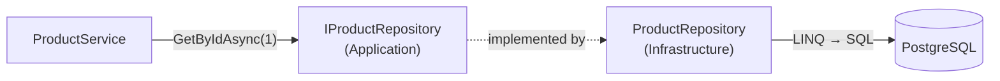
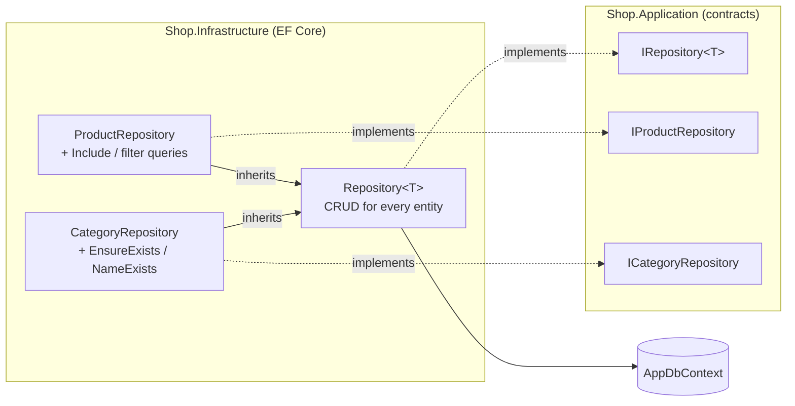

# 2. Repository Pattern

## Definition
A **repository** acts like an **in-memory collection of entities** (`Add`, `Remove`, `GetById`) and hides *how* data is stored.
Services talk to `IProductRepository`, never to `DbContext` or SQL.



### Generic + specific

```mermaid
classDiagram
    class IRepository~T~ {
        <<interface>>
        GetByIdAsync(id)
        GetAllAsync()
        AddAsync(entity)
        Remove(entity)
    }
    class IProductRepository {
        <<interface>>
        GetAllWithCategoryAsync()
        GetByIdWithCategoryAsync(id)
        GetByCategoryAsync(categoryId)
    }
    class ICategoryRepository {
        <<interface>>
        EnsureExistsAsync(id)
        NameExistsAsync(name)
    }
    IRepository~T~ <|-- IProductRepository
    IRepository~T~ <|-- ICategoryRepository
    class Repository~T~
    class ProductRepository
    class CategoryRepository
    IRepository~T~ <|.. Repository~T~
    Repository~T~ <|-- ProductRepository
    Repository~T~ <|-- CategoryRepository
    IProductRepository <|.. ProductRepository
    ICategoryRepository <|.. CategoryRepository
```


## Example

**Contract** (`Shop.Application/Interfaces/IRepository.cs`):
```csharp
public interface IRepository<T> where T : class
{
    Task<T?> GetByIdAsync(int id, CancellationToken ct = default);
    Task<List<T>> GetAllAsync(CancellationToken ct = default);
    Task AddAsync(T entity, CancellationToken ct = default);
    void Remove(T entity);
    // no SaveChanges here: committing is the Unit of Work's job
}
```

**Specific contracts** (`Shop.Application/Interfaces/`):
```csharp
public interface IProductRepository : IRepository<Product>
{
    Task<List<Product>> GetAllWithCategoryAsync(CancellationToken ct = default);
    Task<Product?> GetByIdWithCategoryAsync(int id, CancellationToken ct = default);
    Task<List<Product>> GetByCategoryAsync(int categoryId, CancellationToken ct = default);
}

public interface ICategoryRepository : IRepository<Category>
{
    // Throws BadRequestException when the category does not exist.
    Task EnsureExistsAsync(int id, CancellationToken ct = default);
    Task<bool> NameExistsAsync(string name, CancellationToken ct = default);
}
```

### Implementation



**1. Generic base** (`Shop.Infrastructure/Repositories/Repository.cs`): written once, reused by every entity.
```csharp
public class Repository<T>(AppDbContext context) : IRepository<T> where T : class
{
    protected readonly AppDbContext Context = context;

    // Tracked: the caller may modify it, then the Unit of Work saves it.
    public async Task<T?> GetByIdAsync(int id, CancellationToken ct = default) =>
        await Context.Set<T>().FindAsync([id], ct);

    // Read-only list: AsNoTracking is faster, with no change tracking.
    public Task<List<T>> GetAllAsync(CancellationToken ct = default) =>
        Context.Set<T>().AsNoTracking().ToListAsync(ct);

    // Only stages the INSERT. Nothing is written until SaveChangesAsync.
    public async Task AddAsync(T entity, CancellationToken ct = default) =>
        await Context.Set<T>().AddAsync(entity, ct);

    // Only stages the DELETE.
    public void Remove(T entity) =>
        Context.Set<T>().Remove(entity);
}
```

**2. Product repository** (`Shop.Infrastructure/Repositories/ProductRepository.cs`): inherits CRUD and adds product-only queries.
```csharp
public class ProductRepository(AppDbContext context) : Repository<Product>(context), IProductRepository
{
    public Task<List<Product>> GetAllWithCategoryAsync(CancellationToken ct = default) =>
        Context.Products
            .AsNoTracking()
            .Include(p => p.Category)
            .OrderBy(p => p.Id)
            .ToListAsync(ct);

    public Task<Product?> GetByIdWithCategoryAsync(int id, CancellationToken ct = default) =>
        Context.Products
            .AsNoTracking()
            .Include(p => p.Category)
            .FirstOrDefaultAsync(p => p.Id == id, ct);

    // Tracked on purpose: the caller modifies these products and the Unit of Work saves them.
    public Task<List<Product>> GetByCategoryAsync(int categoryId, CancellationToken ct = default) =>
        Context.Products
            .Where(p => p.CategoryId == categoryId)
            .ToListAsync(ct);
}
```

**3. Category repository** (`Shop.Infrastructure/Repositories/CategoryRepository.cs`): inherits CRUD and adds category checks.
```csharp
public class CategoryRepository(AppDbContext context) : Repository<Category>(context), ICategoryRepository
{
    public async Task EnsureExistsAsync(int id, CancellationToken ct = default)
    {
        if (!await Context.Categories.AnyAsync(c => c.Id == id, ct))
            throw new BadRequestException($"Category {id} does not exist.");
    }

    public Task<bool> NameExistsAsync(string name, CancellationToken ct = default) =>
        Context.Categories.AnyAsync(c => c.Name == name, ct);
}
```

### What each method sends to PostgreSQL
| Call | SQL | Hits the DB |
|---|---|---|
| `Products.GetAllWithCategoryAsync()` | `SELECT p.*, c.* FROM "Products" p INNER JOIN "Categories" c … ORDER BY p."Id"` | immediately |
| `Products.GetByIdAsync(1)` | `SELECT … WHERE "Id" = 1 LIMIT 1` (skipped if already tracked) | immediately |
| `Categories.EnsureExistsAsync(1)` | `SELECT EXISTS (SELECT 1 FROM "Categories" WHERE "Id" = 1)` | immediately |
| `Products.AddAsync(p)` | `INSERT INTO "Products" …` | **on `SaveChangesAsync`** |
| `Categories.Remove(c)` | `DELETE FROM "Categories" WHERE "Id" = …` | **on `SaveChangesAsync`** |

Reads run right away. Writes are only **staged**, and the [Unit of Work](03-unit-of-work.md) commits them.

### Where they get created
Repositories are **not** registered in DI. `UnitOfWork` creates them over its own `DbContext`, so they all share it:
```csharp
public IProductRepository Products => _products ??= new ProductRepository(context);
public ICategoryRepository Categories => _categories ??= new CategoryRepository(context);
```

**Usage** (service, with no EF Core in sight):
```csharp
var products = await unitOfWork.Products.GetAllWithCategoryAsync(ct);
```

### Without vs with
```csharp
// ❌ Without: query logic copy-pasted into every service, tied to EF Core
var p = await _db.Products.AsNoTracking().Include(x => x.Category).FirstOrDefaultAsync(x => x.Id == id);

// ✅ With: one named method, one place to change
var p = await unitOfWork.Products.GetByIdWithCategoryAsync(id, ct);
```

## Benefits
| Benefit | Concrete case in Shop.Demo |
|---|---|
| Queries in one place | `Include(p => p.Category)` is written once, in `ProductRepository`, not in every service. |
| Readable services | `Categories.NameExistsAsync("Books")` reads like business language. |
| Reusable checks | `Categories.EnsureExistsAsync(id)` is used by `ProductService` (create/update) and `CategoryService` (delete + move). The rule is written once. |
| Easy to mock | Tests replace `IProductRepository` with an in-memory list. |
| Storage hidden | Moving products to Dapper or raw SQL changes only `ProductRepository`. |
| Less duplication | `Repository<T>` gives every entity CRUD for free. `CategoryRepository` adds just 2 methods. |
