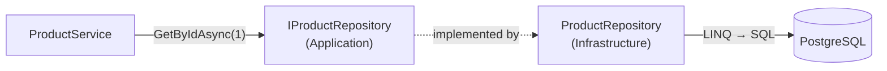
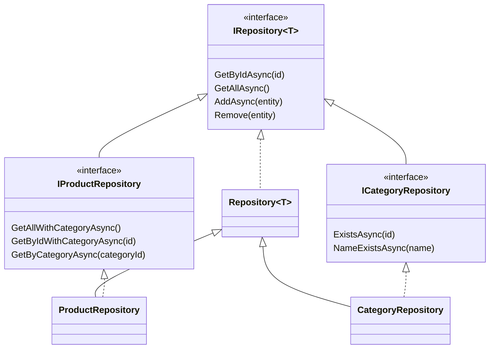

# 2. Repository Pattern

## Definition
A **repository** acts like an **in-memory collection of entities** (`Add`, `Remove`, `GetById`) and hides *how* data is stored.
Services talk to `IProductRepository`, never to `DbContext` or SQL.



### Generic + specific


## Example

**Contract** (`Shop.Application/Interfaces/IRepository.cs`):
```csharp
public interface IRepository<T> where T : class
{
    Task<T?> GetByIdAsync(int id, CancellationToken ct = default);
    Task<List<T>> GetAllAsync(CancellationToken ct = default);
    Task AddAsync(T entity, CancellationToken ct = default);
    void Remove(T entity);
    // no SaveChanges here: committing is the Unit of Work's job
}
```

**Implementation** (`Shop.Infrastructure/Repositories/ProductRepository.cs`):
```csharp
public class ProductRepository(AppDbContext context) : Repository<Product>(context), IProductRepository
{
    public Task<List<Product>> GetAllWithCategoryAsync(CancellationToken ct = default) =>
        Context.Products
            .AsNoTracking()
            .Include(p => p.Category)
            .OrderBy(p => p.Id)
            .ToListAsync(ct);
}
```

**Usage** (service, with no EF Core in sight):
```csharp
var products = await unitOfWork.Products.GetAllWithCategoryAsync(ct);
```

### Without vs with
```csharp
// ❌ Without: query logic copy-pasted into every service, tied to EF Core
var p = await _db.Products.AsNoTracking().Include(x => x.Category).FirstOrDefaultAsync(x => x.Id == id);

// ✅ With: one named method, one place to change
var p = await unitOfWork.Products.GetByIdWithCategoryAsync(id, ct);
```

## Benefits
| Benefit | Concrete case in Shop.Demo |
|---|---|
| Queries in one place | `Include(p => p.Category)` is written once, in `ProductRepository`, not in every service. |
| Readable services | `Categories.NameExistsAsync("Books")` reads like business language. |
| Easy to mock | Tests replace `IProductRepository` with an in-memory list. |
| Storage hidden | Moving products to Dapper or raw SQL changes only `ProductRepository`. |
| Less duplication | `Repository<T>` gives every entity CRUD for free. `CategoryRepository` adds just 2 methods. |
