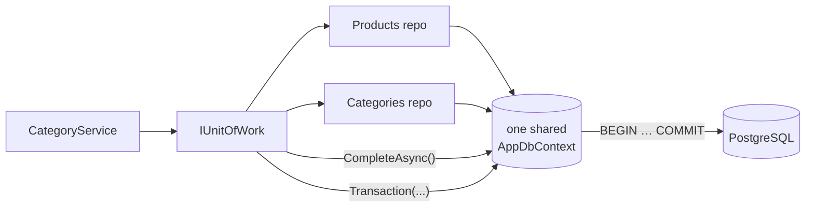
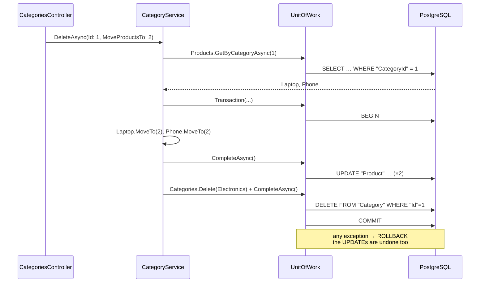
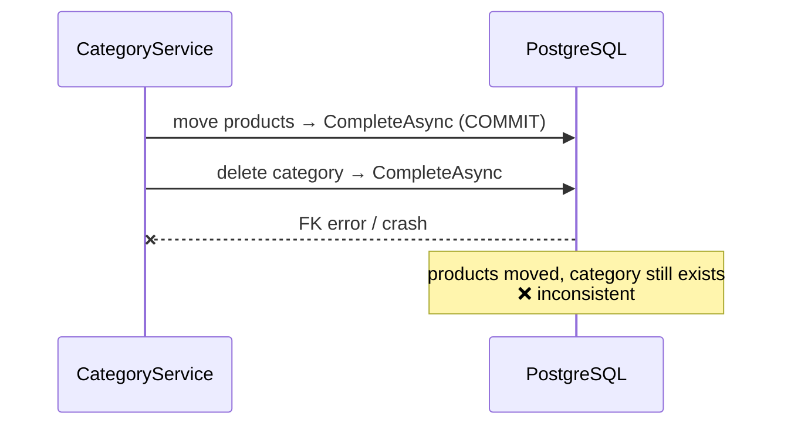

# 2. Unit of Work

## Definition
A **Unit of Work** tracks every change made through the repositories during one business operation and **commits them together**.
Either **everything** is saved, or **nothing** is.



The key: **all repositories share the same `DbContext`**, so `CompleteAsync` covers all of them.

| Method | Use it when | SQL |
|---|---|---|
| `CompleteAsync` | All changes can be staged, then saved **once** | 1 `SaveChanges` = 1 implicit transaction |
| `Transaction(func)` | Several `CompleteAsync` calls must succeed or fail **together** | `BEGIN` … all saves … `COMMIT` / `ROLLBACK` (+ Polly retry) |

## Example

**Contract** (`Shop.Application/Abstracts/IUnitOfWork.cs`):
```csharp
public interface IUnitOfWork
{
    IProductRepository Products { get; }
    ICategoryRepository Categories { get; }

    Task CompleteAsync(CancellationToken cancellationToken);
    Task Transaction(Func<Task> doTransaction, CancellationToken cancellationToken);
}
```

**Implementation** (`Shop.Infrastructure/Repositories/UnitOfWork.cs`):
```csharp
public class UnitOfWork(AppDbContext dbContext) : IUnitOfWork
{
    // Retries the whole transaction up to 3 times on DbUpdateException (200ms, exponential).
    private static readonly ResiliencePipeline _retryPipeline = new ResiliencePipelineBuilder()
        .AddRetry(new RetryStrategyOptions
        {
            ShouldHandle = new PredicateBuilder().Handle<DbUpdateException>(),
            MaxRetryAttempts = 3,
            Delay = TimeSpan.FromMilliseconds(200),
            BackoffType = DelayBackoffType.Exponential
        })
        .Build();

    private IProductRepository? _products;
    private ICategoryRepository? _categories;

    public IProductRepository Products => _products ??= new ProductRepository(dbContext);
    public ICategoryRepository Categories => _categories ??= new CategoryRepository(dbContext);

    public Task CompleteAsync(CancellationToken cancellationToken)
        => dbContext.SaveChangesAsync(cancellationToken);

    public async Task Transaction(Func<Task> doTransaction, CancellationToken cancellationToken)
    {
        await _retryPipeline.ExecuteAsync(async ct =>
        {
            using var transaction = await dbContext.Database.BeginTransactionAsync(ct);
            try
            {
                await doTransaction();
                await transaction.CommitAsync(ct);
            }
            catch
            {
                await transaction.RollbackAsync(ct);
                throw;
            }
        }, cancellationToken);
    }
}
```

### Simple case: `CompleteAsync`
`POST /api/v1.0/products`, in `ProductService.AddAsync`:
```csharp
var product = Product.Create(model.Name, model.Price, model.Stock, model.CategoryId);

await unitOfWork.Products.AddAsync(product, cancellationToken);   // staged
await unitOfWork.CompleteAsync(cancellationToken);                // INSERT, committed
```

### Showcase: `Transaction`, delete a category and move its products
`DELETE /api/v1.0/categories/1?moveTo=2`, in `CategoryService.DeleteAsync`:
```csharp
await unitOfWork.Transaction(async () =>
{
    foreach (var product in products)
        product.MoveTo(model.MoveProductsTo!.Value);           // change #1 (Products repository)
    await unitOfWork.CompleteAsync(cancellationToken);

    unitOfWork.Categories.Delete(category, cancellationToken);  // change #2 (Categories repository)
    await unitOfWork.CompleteAsync(cancellationToken);
}, cancellationToken);
```

Actual PostgreSQL log (`log_statement = 'all'`) for this request:
```sql
BEGIN TRANSACTION ISOLATION LEVEL READ COMMITTED
UPDATE "Product" SET "CategoryId" = $1 WHERE "Id" = $2   -- × each product
DELETE FROM "Category" WHERE "Id" = $1
COMMIT
```



### What if it failed halfway?
| Approach | Products moved? | Category deleted? | Result |
|---|---|---|---|
| ❌ Two `CompleteAsync` calls **without** `Transaction`; delete crashes | ✅ yes (already committed) | ❌ no | **Inconsistent**: half done |
| ✅ Two `CompleteAsync` calls **inside** `Transaction`; delete crashes | ❌ rolled back | ❌ no | **Consistent**: nothing changed |

## Benefits
| Benefit | Concrete case in Shop.Demo |
|---|---|
| Atomic operations | Move 2 products + delete 1 category = 1 transaction (`BEGIN … COMMIT`). |
| One dependency | Services inject only `IUnitOfWork` instead of N repositories + DbContext. |
| Same DbContext everywhere | `Products` and `Categories` see each other's tracked changes. |
| Automatic retry | `Transaction` retries the whole unit up to 3× on `DbUpdateException` (Polly). |
| Explicit commit point | `CompleteAsync` shows exactly where data hits the DB. Repositories never save on their own. |

## Anti-patterns

| # | Anti-pattern | Symptom |
|---|---|---|
| 1 | Each repository has its own `DbContext` | `CompleteAsync` misses the other repository's changes |
| 2 | Many `CompleteAsync` calls without `Transaction` | Partial commits on failure |
| 3 | `CompleteAsync` inside a loop | 1,000 items → 1,000 transactions |
| 4 | `DbContext` / `UnitOfWork` registered as Singleton | Requests corrupt each other's data |
| 5 | Services bypass the UoW and inject `AppDbContext` | Two paths to the DB, rules skipped |
| 6 | Slow external calls inside `Transaction` | Locks held for seconds |

### 1. Each repository has its own `DbContext`
```csharp
// ❌ Two contexts → two change trackers → two transactions
public IProductRepository Products => new ProductRepository(new AppDbContext(_options));
public ICategoryRepository Categories => new CategoryRepository(new AppDbContext(_options));
public Task CompleteAsync(CancellationToken ct) => _dbContext.SaveChangesAsync(ct);   // saves NEITHER of them
```
```csharp
// ✅ One shared context (Shop.Demo)
public IProductRepository Products => _products ??= new ProductRepository(dbContext);
public ICategoryRepository Categories => _categories ??= new CategoryRepository(dbContext);
```

### 2. Many `CompleteAsync` calls without `Transaction`

✅ Either stage everything and call `CompleteAsync` **once**, or wrap the calls in `unitOfWork.Transaction(...)` (see `CategoryService.DeleteAsync`).

### 3. `CompleteAsync` inside a loop
```csharp
// ❌ 1,000 products → 1,000 round-trips + 1,000 transactions
foreach (var p in products) { p.MoveTo(moveTo); await unitOfWork.CompleteAsync(cancellationToken); }

// ✅ 1 transaction, batched statements
foreach (var p in products) p.MoveTo(moveTo);
await unitOfWork.CompleteAsync(cancellationToken);
```

### 4. Wrong lifetime
```csharp
// ❌ One DbContext shared by every request: not thread-safe, stale tracked entities
services.AddSingleton<IUnitOfWork, UnitOfWork>();

// ✅ One per HTTP request (Shop.Demo, RegisterInfrastructure)
services.AddScoped<IUnitOfWork, UnitOfWork>();   // AddDbContext is Scoped by default
```

### 5. Bypassing the Unit of Work
```csharp
// ❌ Half the code uses the UoW, half writes to the DbContext directly
public class ProductService(IUnitOfWork unitOfWork, AppDbContext db) { ... db.Add(p); ... }
```
✅ Services depend on `IUnitOfWork` **only**. Application can't even see `AppDbContext`, because it's in Infrastructure.

### 6. Slow work inside `Transaction`
```csharp
// ❌ Rows locked while waiting on an email server, and Polly may resend the email on retry
await unitOfWork.Transaction(async () =>
{
    ...; await unitOfWork.CompleteAsync(ct);
    await emailSender.SendAsync(...);   // 3 seconds
}, ct);
```
✅ Commit first, then do external calls (email, HTTP, queues) **after** the transaction.

---
[← 1. Repository Pattern](01-repository-pattern.md) · [Next: 3. Clean Architecture →](03-clean-architecture.md)
