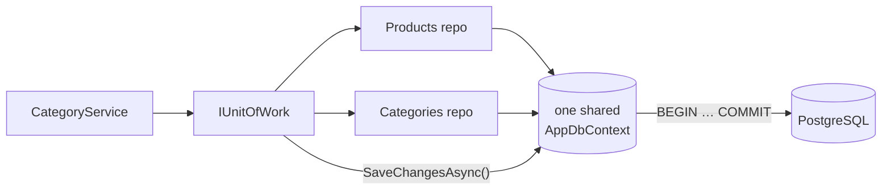
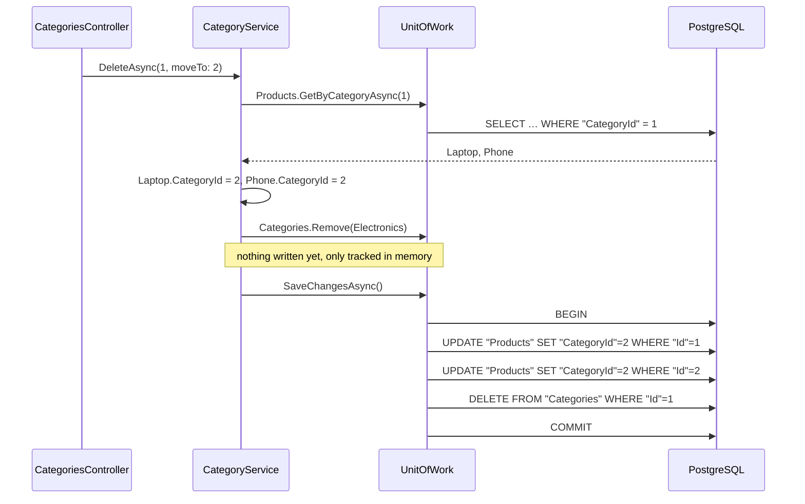

# 2. Unit of Work

## Definition
A **Unit of Work** tracks every change made through the repositories during one business operation and **commits them all at once, in one transaction**.
Either **everything** is saved, or **nothing** is.



The key: **all repositories share the same `DbContext`**, so one `SaveChangesAsync` covers all of them.

## Example

**Contract** (`Shop.Application/Interfaces/IUnitOfWork.cs`):
```csharp
public interface IUnitOfWork
{
    IProductRepository Products { get; }
    ICategoryRepository Categories { get; }
    Task<int> SaveChangesAsync(CancellationToken ct = default);
}
```

**Implementation** (`Shop.Infrastructure/Persistence/UnitOfWork.cs`):
```csharp
public class UnitOfWork(AppDbContext context) : IUnitOfWork
{
    private IProductRepository? _products;
    private ICategoryRepository? _categories;

    public IProductRepository Products => _products ??= new ProductRepository(context);
    public ICategoryRepository Categories => _categories ??= new CategoryRepository(context);

    public Task<int> SaveChangesAsync(CancellationToken ct = default) => context.SaveChangesAsync(ct);
}
```

### Showcase: delete a category and move its products
`DELETE /api/categories/1?moveTo=2`, in `CategoryService.DeleteAsync`:
```csharp
var products = await unitOfWork.Products.GetByCategoryAsync(id, ct);

foreach (var product in products)
    product.CategoryId = moveProductsTo.Value;      // change #1 (Products repository)

unitOfWork.Categories.Remove(category);             // change #2 (Categories repository)

await unitOfWork.SaveChangesAsync(ct);              // ONE transaction for both
```



### What if it failed halfway?
| Approach | Products moved? | Category deleted? | Result |
|---|---|---|---|
| ❌ Each repo saves itself (`Products.Save()` then `Categories.Save()`); delete crashes | ✅ yes | ❌ no | **Inconsistent**: half done |
| ✅ Unit of Work, one `SaveChangesAsync`; delete crashes | ❌ rolled back | ❌ no | **Consistent**: nothing changed |

## Benefits
| Benefit | Concrete case in Shop.Demo |
|---|---|
| Atomic operations | Move 2 products + delete 1 category = 1 transaction (`BEGIN … COMMIT`). |
| One dependency | Services inject only `IUnitOfWork` instead of N repositories + DbContext. |
| Same DbContext everywhere | `Products` and `Categories` see each other's tracked changes. |
| Fewer round-trips | 3 SQL statements sent in one batch on save. |
| Explicit commit point | `SaveChangesAsync` shows exactly where data hits the DB. Repositories never save on their own. |

## Anti-patterns

| # | Anti-pattern | Symptom |
|---|---|---|
| 1 | Each repository has its own `DbContext` | `SaveChanges` misses the other repository's changes |
| 2 | Many `SaveChanges` calls in one operation | Partial commits on failure |
| 3 | `SaveChanges` inside a loop | 1,000 items → 1,000 transactions |
| 4 | `DbContext` / `UnitOfWork` registered as Singleton | Requests corrupt each other's data |
| 5 | Services bypass the UoW and inject `AppDbContext` | Two paths to the DB, rules skipped |
| 6 | Slow external calls inside the transaction | Locks held for seconds |

### 1. Each repository has its own `DbContext`
```csharp
// ❌ Two contexts → two change trackers → two transactions
public IProductRepository Products => new ProductRepository(new AppDbContext(_options));
public ICategoryRepository Categories => new CategoryRepository(new AppDbContext(_options));
public Task<int> SaveChangesAsync() => _context.SaveChangesAsync();   // saves NEITHER of them
```
```csharp
// ✅ One shared context (Shop.Demo)
public IProductRepository Products => _products ??= new ProductRepository(context);
public ICategoryRepository Categories => _categories ??= new CategoryRepository(context);
```

### 2. Many `SaveChanges` calls in one business operation

✅ Stage everything, then call `SaveChangesAsync` **once** at the end (see `CategoryService.DeleteAsync`).

### 3. `SaveChanges` inside a loop
```csharp
// ❌ 1,000 products → 1,000 round-trips + 1,000 transactions
foreach (var p in products) { p.CategoryId = moveTo; await unitOfWork.SaveChangesAsync(ct); }

// ✅ 1 transaction, batched statements
foreach (var p in products) p.CategoryId = moveTo;
await unitOfWork.SaveChangesAsync(ct);
```

### 4. Wrong lifetime
```csharp
// ❌ One DbContext shared by every request: not thread-safe, stale tracked entities
services.AddSingleton<IUnitOfWork, UnitOfWork>();

// ✅ One per HTTP request (Shop.Demo)
services.AddScoped<IUnitOfWork, UnitOfWork>();   // AddDbContext is Scoped by default
```

### 5. Bypassing the Unit of Work
```csharp
// ❌ Half the code uses the UoW, half writes to the DbContext directly
public class ProductService(IUnitOfWork unitOfWork, AppDbContext db) { ... db.Products.Add(p); ... }
```
✅ Services depend on `IUnitOfWork` **only**. Application can't even see `AppDbContext`, because it's in Infrastructure.

### 6. Slow work inside the transaction
```csharp
// ❌ Rows locked while waiting on an email server
await using var tx = await db.Database.BeginTransactionAsync();
...; await emailSender.SendAsync(...); // 3 seconds
await tx.CommitAsync();
```
✅ Commit first, then do external calls (email, HTTP, queues) **after** `SaveChangesAsync`.

---
[← 1. Repository Pattern](01-repository-pattern.md) · [Next: 3. Clean Architecture →](03-clean-architecture.md)
