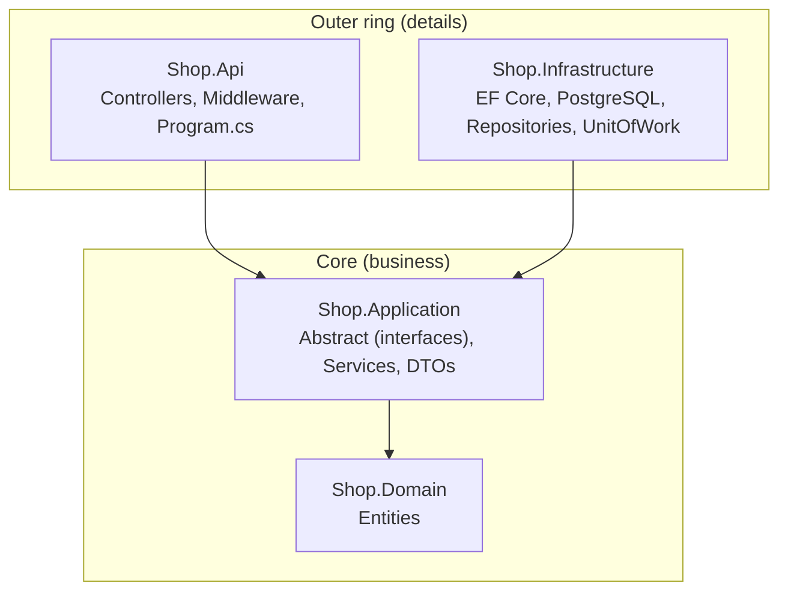
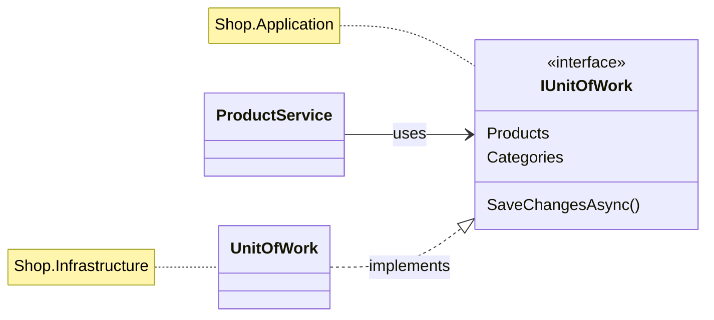
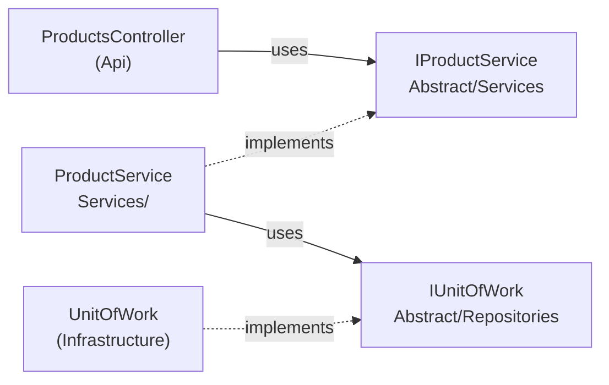
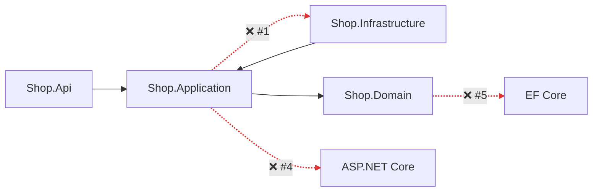

# 3. Clean Architecture

## Definition
Organize the app into **layers (rings)** where **dependencies point inward only**.
The business core (Domain + Application) knows nothing about databases, frameworks, or HTTP.



| Layer | Contains | References |
|---|---|---|
| `Shop.Domain` | `Product`, `Category` | nothing |
| `Shop.Application` | `Abstract/Repositories` (`IUnitOfWork`, `IProductRepository`), `Abstract/Services` (`IProductService`), `ProductService`, DTOs | Domain |
| `Shop.Infrastructure` | `AppDbContext`, `ProductRepository`, `UnitOfWork` | Application |
| `Shop.Api` | `ProductsController`, `ErrorHandlingMiddleware` | Application + Infrastructure (DI only) |

### The trick: Dependency Inversion
Application **defines** the interface. Infrastructure **implements** it.



### Two kinds of abstractions in Application

| Folder | Contains | Implemented by | Used by |
|---|---|---|---|
| `Abstract/Repositories` | `IRepository<T>`, `IProductRepository`, `ICategoryRepository`, `IUnitOfWork` | Infrastructure | Application services |
| `Abstract/Services` | `IProductService`, `ICategoryService` | Application `Services/` | Api controllers |

## Example

`Shop.Application/Services/ProductService.cs`: no `using Microsoft.EntityFrameworkCore`, no `Npgsql`:
```csharp
public class ProductService(IUnitOfWork unitOfWork) : IProductService
{
    public async Task<int> CreateAsync(CreateProductRequest request, CancellationToken ct)
    {
        await unitOfWork.Categories.EnsureExistsAsync(request.CategoryId, ct);

        var product = new Product { Name = request.Name, Price = request.Price, ... };

        await unitOfWork.Products.AddAsync(product, ct);
        await unitOfWork.SaveChangesAsync(ct);
        return product.Id;
    }
}
```

`Shop.Api/Program.cs`, the **composition root** (the only place that knows every layer):
```csharp
builder.Services.AddApplication();                                   // services
builder.Services.AddInfrastructure(connectionString);                // EF Core + UoW
```

The compiler enforces the rule:
```xml
<!-- Shop.Application.csproj : can only see Domain -->
<ProjectReference Include="..\Shop.Domain\Shop.Domain.csproj" />
```
If Application tries to use `AppDbContext`, it **fails to compile**.

## Benefits
| Benefit | Concrete case in Shop.Demo |
|---|---|
| Swap the database | PostgreSQL → SQL Server: change **1 line** in `Infrastructure/DependencyInjection.cs` (`UseNpgsql` → `UseSqlServer`). Services stay untouched. |
| Testable core | `ProductService` can be tested with a fake `IUnitOfWork`, with no Docker or DB. |
| Thin controllers | `ProductsController` is 5 one-line actions. All rules live in services. |
| Clear place for everything | New rule → Application. New table → Domain + Infrastructure. New endpoint → Api. |
| Framework independence | Domain entities are plain C# classes, so they survive any framework upgrade. |

## Anti-patterns

| # | Anti-pattern | Rule broken |
|---|---|---|
| 1 | Application references Infrastructure | Dependencies must point inward |
| 2 | Fat controllers | Presentation does HTTP only |
| 3 | Returning Domain entities from the API | Entities ≠ API contract |
| 4 | HTTP types in Application | Core is framework-free |
| 5 | Persistence attributes in Domain | Domain has no dependencies |
| 6 | Pass-through layers everywhere | Layers must earn their place |



### 1. Application references Infrastructure
```csharp
// ❌ The core now depends on EF Core + PostgreSQL
using Shop.Infrastructure.Persistence;
public class ProductService(AppDbContext db) { ... }
```
✅ Application defines `IUnitOfWork`; Infrastructure implements it. Shop.Demo makes this a **compile error**, because `Shop.Application.csproj` doesn't reference Infrastructure.

### 2. Fat controllers
```csharp
// ❌ Validation, DB access and rules inside the controller
[HttpPost]
public async Task<IActionResult> Create(CreateProductRequest r)
{
    if (!await _db.Categories.AnyAsync(c => c.Id == r.CategoryId)) return BadRequest();
    _db.Products.Add(new Product { ... });
    await _db.SaveChangesAsync();
    return Ok();
}
```
```csharp
// ✅ Shop.Demo: one line of delegation
var id = await productService.CreateAsync(request, ct);
return CreatedAtAction(nameof(GetById), new { id }, new { id });
```

### 3. Returning Domain entities from the API
```csharp
// ❌ Product.Category.Products[0].Category... → JSON cycle error, and every DB column is exposed
[HttpGet] public Task<List<Product>> GetAll() => ...;
```
✅ Return DTOs: `ProductDto(Id, Name, Price, Stock, CategoryId, CategoryName)`. The table can change without breaking clients.

### 4. HTTP types in Application
```csharp
// ❌ The service knows about HTTP status codes
public async Task<IActionResult> GetByIdAsync(int id) => product is null ? new NotFoundResult() : new OkObjectResult(dto);
```
✅ Throw `NotFoundException`; `ErrorHandlingMiddleware` (Api) maps it to `404`. The same service works from a CLI or a background job.

### 5. Persistence attributes in Domain
```csharp
// ❌ Domain now depends on EF Core / database naming
[Table("tbl_products")]
public class Product { [Key, Column("product_id")] public int Id { get; set; } }
```
✅ Domain stays plain C#. Mapping lives in `AppDbContext.OnModelCreating` (Infrastructure).

### 6. Pass-through layers everywhere
```csharp
// ❌ Service, Manager, Handler, Repository that all just forward the same call
public Task<ProductDto> GetAsync(int id) => _manager.GetAsync(id);   // → _handler.GetAsync(id) → _repo...
```
✅ Each layer must **add** something: rules, mapping, transactions, or HTTP. If it only forwards, delete it.

---
[← 2. Unit of Work](02-unit-of-work.md) · [Next: 4. Putting It Together →](04-putting-it-together.md)
