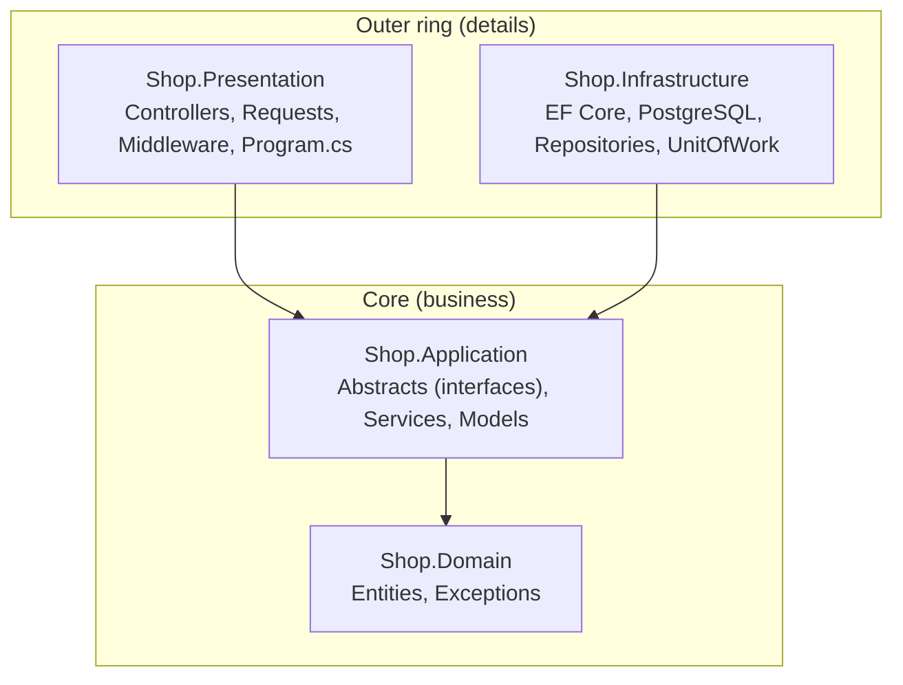
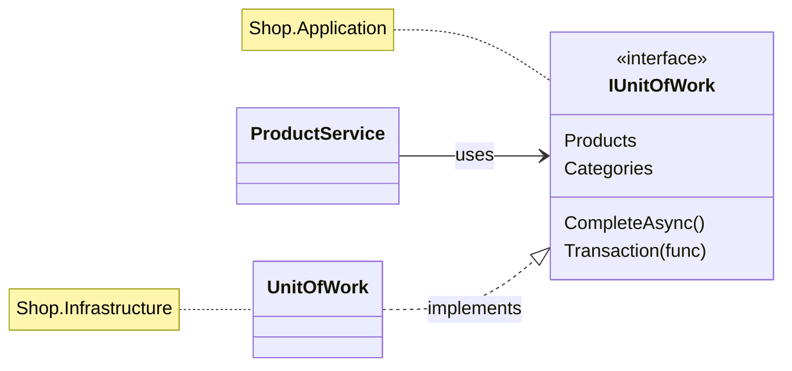
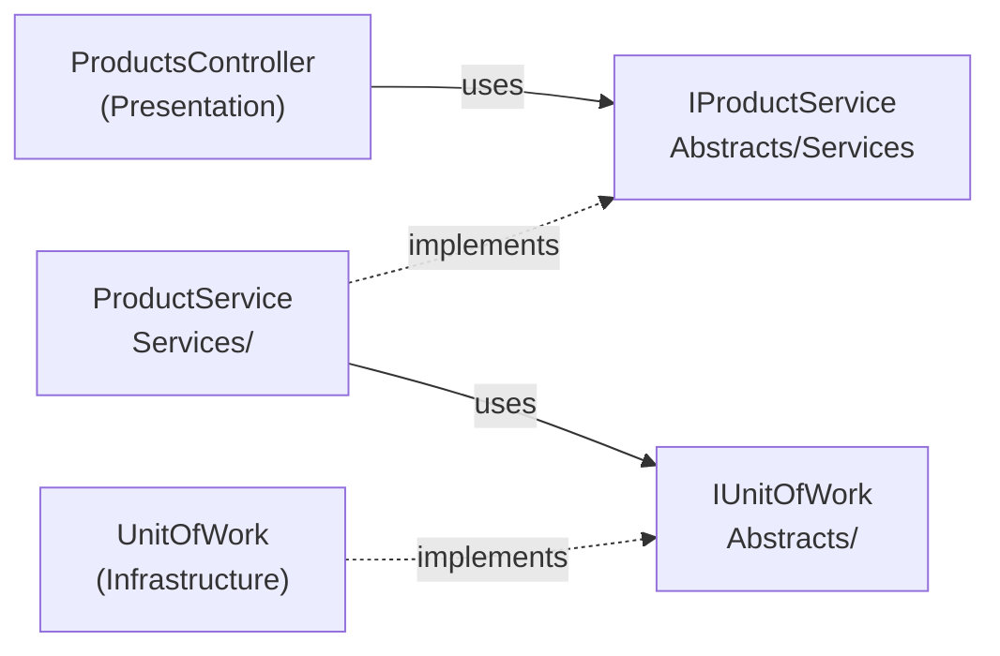
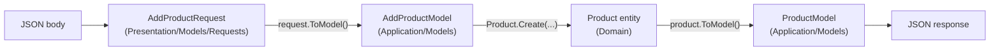
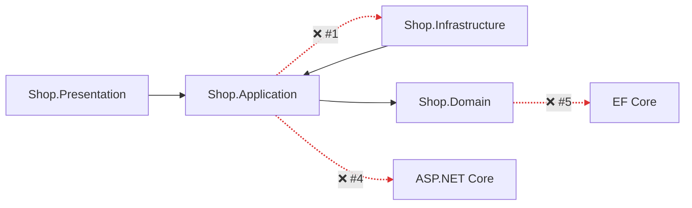

# 3. Clean Architecture

## Definition
Organize the app into **layers (rings)** where **dependencies point inward only**.
The business core (Domain + Application) knows nothing about databases, frameworks, or HTTP.



| Layer | Folders | References |
|---|---|---|
| `Shop.Domain` | `Entities/` (`IEntity`, `Product`, `Category`), `Exceptions/` (`NotFoundException`, `AlreadyExistsException`, `FailedPreconditionException`, `Abstraction/IProblemDetailsProvider`) | nothing |
| `Shop.Application` | `Abstracts/` (`IRepository<T>`, `IUnitOfWork`, `Repositories/`, `Services/`), `Services/`, `Models/`, `Extensions/` (`RegistrationExtensions`, `MapperExtensions`) | Domain |
| `Shop.Infrastructure` | `Persistence/` (`AppDbContext`, `Configurations/`), `Repositories/` (`Repository<T>`, `ProductRepository`, `CategoryRepository`, `UnitOfWork`), `Extensions/RegistrationExtensions` | Application |
| `Shop.Presentation` | `Controllers/` (`BaseController`, …), `Models/Requests/`, `Extensions/Mapper/`, `Middleware/ErrorHandlingMiddleware` | Application + Infrastructure (DI only) |

### The trick: Dependency Inversion
Application **defines** the interface. Infrastructure **implements** it.



### Two kinds of abstractions in Application

| Folder | Contains | Implemented by | Used by |
|---|---|---|---|
| `Abstracts/` | `IRepository<T>`, `IUnitOfWork` | Infrastructure | Application services |
| `Abstracts/Repositories` | `IProductRepository`, `ICategoryRepository` | Infrastructure | Application services (via `IUnitOfWork`) |
| `Abstracts/Services` | `IProductService`, `ICategoryService` | Application `Services/` | Presentation controllers |

### Data shapes per layer

Each layer owns its own shape. A change to the HTTP contract doesn't touch the entity, and vice versa.

## Example

**Domain** (`Shop.Domain/Entities/Product.cs`): private constructor, created only through `Create`, changed only through methods.
```csharp
public class Product : IEntity
{
    public string Name { get; private set; } = string.Empty;
    public decimal Price { get; private set; }
    public int Stock { get; private set; }
    public int CategoryId { get; private set; }
    public Category? Category { get; private set; }

    private Product() { }

    public static Product Create(string name, decimal price, int stock, int categoryId) => new()
    {
        Name = name, Price = price, Stock = stock, CategoryId = categoryId
    };

    public void Update(string name, decimal price, int stock, int categoryId) { ... }
    public void MoveTo(int categoryId) => CategoryId = categoryId;
}
```

**Application** (`Shop.Application/Services/ProductService.cs`): no `using Microsoft.EntityFrameworkCore`, no `Npgsql`.
```csharp
public class ProductService(IUnitOfWork unitOfWork) : IProductService
{
    public async Task<int> AddAsync(AddProductModel model, CancellationToken cancellationToken)
    {
        await unitOfWork.Categories.EnsureExistsAsync(model.CategoryId, cancellationToken);

        var product = Product.Create(model.Name, model.Price, model.Stock, model.CategoryId);

        await unitOfWork.Products.AddAsync(product, cancellationToken);
        await unitOfWork.CompleteAsync(cancellationToken);
        return product.Id;
    }
}
```

**Presentation** (`Shop.Presentation/Controllers/ProductsController.cs`): every controller inherits `BaseController` → route `api/v1.0/[controller]`.
```csharp
[ApiController]
[Route(BaseUrl)]
public abstract class BaseController : ControllerBase
{
    public const string BaseUrl = "api/v1.0/[controller]";
}

public class ProductsController(IProductService productService) : BaseController
{
    [HttpPost]
    public async Task<IActionResult> Add(AddProductRequest request, CancellationToken cancellationToken)
    {
        var id = await productService.AddAsync(request.ToModel(), cancellationToken);
        return CreatedAtAction(nameof(GetById), new { id }, new { id });
    }
}
```

**Errors cross layers without HTTP leaking inward**: Domain exceptions describe themselves; Presentation maps them to status codes.
```csharp
// Shop.Domain/Exceptions/NotFoundException.cs
public class NotFoundException(string message) : Exception(message), IProblemDetailsProvider
{
    public ServiceProblemDetails GetProblemDetails() => new() { Title = Message, Type = "Not Found" };
}

// Shop.Presentation/Middleware/ErrorHandlingMiddleware.cs
catch (Exception ex) when (ex is IProblemDetailsProvider provider)
{
    await WriteError(context, provider.GetProblemDetails());   // "Not Found" → 404, "Already Exists" → 409, …
}
```

**Composition root** (`Shop.Presentation/Program.cs`): the only place that knows every layer. Each layer registers itself.
```csharp
builder.Services
    .RegisterPresentation()
    .RegisterApplication()                          // IProductService → ProductService, …
    .RegisterInfrastructure(builder.Configuration); // AppDbContext (Npgsql) + IUnitOfWork → UnitOfWork
```

The compiler enforces the rule:
```xml
<!-- Shop.Application.csproj : can only see Domain -->
<ProjectReference Include="..\Shop.Domain\Shop.Domain.csproj" />
```
If Application tries to use `AppDbContext`, it **fails to compile**.

## Benefits
| Benefit | Concrete case in Shop.Demo |
|---|---|
| Swap the database | PostgreSQL → SQL Server: change **1 line** in `Infrastructure/Extensions/RegistrationExtensions.cs` (`UseNpgsql` → `UseSqlServer`). Services stay untouched. |
| Testable core | `ProductService` can be tested with a fake `IUnitOfWork`, with no Docker or DB. |
| Thin controllers | `ProductsController` is 5 one-line actions. All rules live in services. |
| Protected entities | `Product` can't be put in an invalid state from outside: no public setters, no `new Product()`. |
| Clear place for everything | New rule → Application/Domain. New table → Domain + `Persistence/Configurations`. New endpoint → Presentation. |
| Framework independence | Domain entities are plain C# classes, so they survive any framework upgrade. |

## Anti-patterns

| # | Anti-pattern | Rule broken |
|---|---|---|
| 1 | Application references Infrastructure | Dependencies must point inward |
| 2 | Fat controllers | Presentation does HTTP only |
| 3 | Returning Domain entities from the API | Entities ≠ API contract |
| 4 | HTTP types in Application | Core is framework-free |
| 5 | Persistence attributes in Domain | Domain has no dependencies |
| 6 | Public setters + `new Entity()` everywhere | Entities guard their own state |
| 7 | Pass-through layers everywhere | Layers must earn their place |



### 1. Application references Infrastructure
```csharp
// ❌ The core now depends on EF Core + PostgreSQL
using Shop.Infrastructure.Persistence;
public class ProductService(AppDbContext db) { ... }
```
✅ Application defines `IUnitOfWork`; Infrastructure implements it. Shop.Demo makes this a **compile error**, because `Shop.Application.csproj` doesn't reference Infrastructure.

### 2. Fat controllers
```csharp
// ❌ Validation, DB access and rules inside the controller
[HttpPost]
public async Task<IActionResult> Add(AddProductRequest r)
{
    var exists = await _db.Set<Category>().AnyAsync(c => c.Id == r.CategoryId);
    if (!exists) return BadRequest();
    _db.Add(Product.Create(r.Name, r.Price, r.Stock, r.CategoryId));
    await _db.SaveChangesAsync();
    return Ok();
}
```
```csharp
// ✅ Shop.Demo: one line of delegation
var id = await productService.AddAsync(request.ToModel(), cancellationToken);
return CreatedAtAction(nameof(GetById), new { id }, new { id });
```

### 3. Returning Domain entities from the API
```csharp
// ❌ Product.Category.Products[0].Category... → JSON cycle error, and every DB column is exposed
[HttpGet] public Task<List<Product>> GetAll() => ...;
```
✅ Return models: `ProductModel(Id, Name, Price, Stock, CategoryId, CategoryName)`. The table can change without breaking clients.

### 4. HTTP types in Application
```csharp
// ❌ The service knows about HTTP status codes
public async Task<IActionResult> GetByIdAsync(int id) => product is null ? new NotFoundResult() : new OkObjectResult(model);
```
✅ Throw `NotFoundException` (Domain); `ErrorHandlingMiddleware` (Presentation) maps it to `404`. The same service works from a CLI or a background job.

### 5. Persistence attributes in Domain
```csharp
// ❌ Domain now depends on EF Core / database naming
[Table("tbl_products")]
public class Product { [Key, Column("product_id")] public int Id { get; set; } }
```
✅ Domain stays plain C#. Mapping lives in `Persistence/Configurations/ProductConfiguration.cs` (Infrastructure), loaded by `ApplyConfigurationsFromAssembly`.

### 6. Public setters + `new Entity()` everywhere
```csharp
// ❌ Any layer can create or corrupt a product
var p = new Product { Name = "", Price = -5 };
p.CategoryId = 999;
```
```csharp
// ✅ Shop.Demo: private constructor + private setters; changes go through named methods
var p = Product.Create(model.Name, model.Price, model.Stock, model.CategoryId);
p.MoveTo(2);
```

### 7. Pass-through layers everywhere
```csharp
// ❌ Service, Manager, Handler, Repository that all just forward the same call
public Task<ProductModel> GetAsync(int id) => _manager.GetAsync(id);   // → _handler.GetAsync(id) → _repo...
```
✅ Each layer must **add** something: rules, mapping, transactions, or HTTP. If it only forwards, delete it.

---
[← 2. Unit of Work](02-unit-of-work.md) · [Next: 4. Putting It Together →](04-putting-it-together.md)
