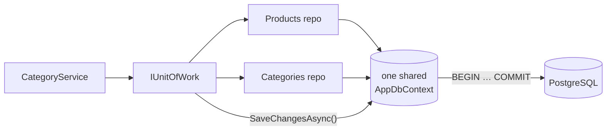
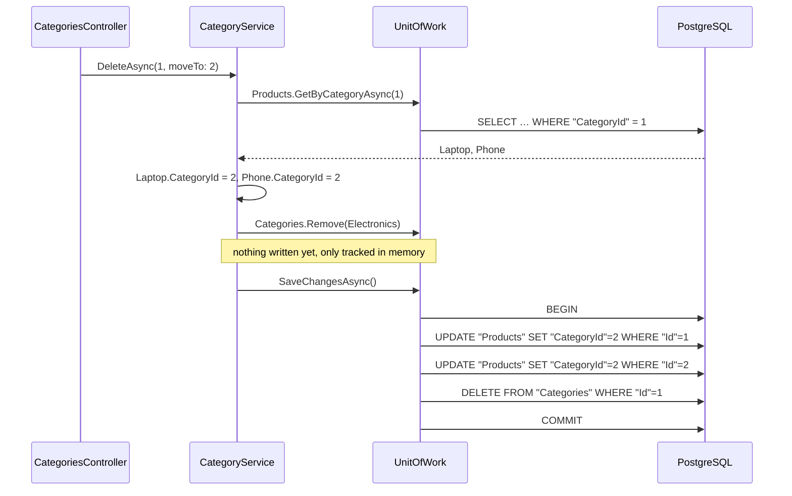

# 3. Unit of Work

## Definition
A **Unit of Work** tracks every change made through the repositories during one business operation and **commits them all at once, in one transaction**.
Either **everything** is saved, or **nothing** is.



The key: **all repositories share the same `DbContext`**, so one `SaveChangesAsync` covers all of them.

## Example

**Contract** (`Shop.Application/Interfaces/IUnitOfWork.cs`):
```csharp
public interface IUnitOfWork
{
    IProductRepository Products { get; }
    ICategoryRepository Categories { get; }
    Task<int> SaveChangesAsync(CancellationToken ct = default);
}
```

**Implementation** (`Shop.Infrastructure/Persistence/UnitOfWork.cs`):
```csharp
public class UnitOfWork(AppDbContext context) : IUnitOfWork
{
    private IProductRepository? _products;
    private ICategoryRepository? _categories;

    public IProductRepository Products => _products ??= new ProductRepository(context);
    public ICategoryRepository Categories => _categories ??= new CategoryRepository(context);

    public Task<int> SaveChangesAsync(CancellationToken ct = default) => context.SaveChangesAsync(ct);
}
```

### Showcase: delete a category and move its products
`DELETE /api/categories/1?moveTo=2`, in `CategoryService.DeleteAsync`:
```csharp
var products = await unitOfWork.Products.GetByCategoryAsync(id, ct);

foreach (var product in products)
    product.CategoryId = moveProductsTo.Value;      // change #1 (Products repository)

unitOfWork.Categories.Remove(category);             // change #2 (Categories repository)

await unitOfWork.SaveChangesAsync(ct);              // ONE transaction for both
```



### What if it failed halfway?
| Approach | Products moved? | Category deleted? | Result |
|---|---|---|---|
| ❌ Each repo saves itself (`Products.Save()` then `Categories.Save()`); delete crashes | ✅ yes | ❌ no | **Inconsistent**: half done |
| ✅ Unit of Work, one `SaveChangesAsync`; delete crashes | ❌ rolled back | ❌ no | **Consistent**: nothing changed |

## Benefits
| Benefit | Concrete case in Shop.Demo |
|---|---|
| Atomic operations | Move 2 products + delete 1 category = 1 transaction (`BEGIN … COMMIT`). |
| One dependency | Services inject only `IUnitOfWork` instead of N repositories + DbContext. |
| Same DbContext everywhere | `Products` and `Categories` see each other's tracked changes. |
| Fewer round-trips | 3 SQL statements sent in one batch on save. |
| Explicit commit point | `SaveChangesAsync` shows exactly where data hits the DB. Repositories never save on their own. |
