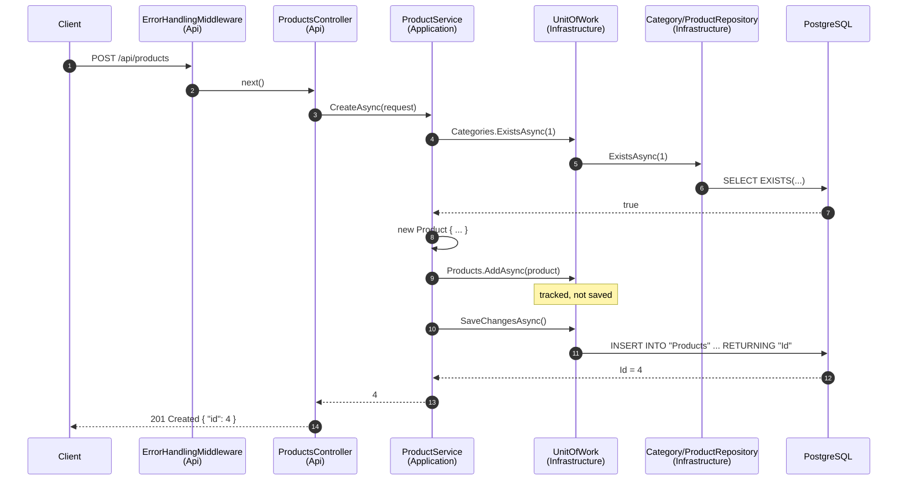
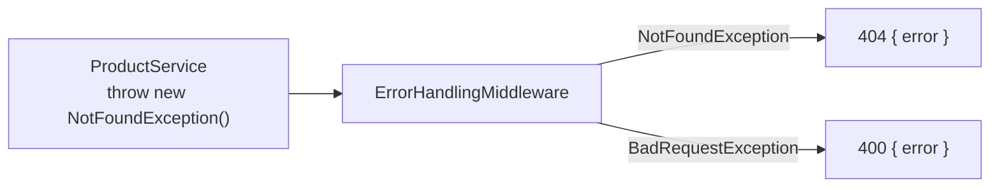

# 4. Putting It Together

## One request through every layer
`POST /api/products` with `{ "name": "Keyboard", "price": 49.99, "stock": 100, "categoryId": 1 }`



## Who does what
| Piece | Pattern | Responsibility |
|---|---|---|
| `Product`, `Category` | Clean Architecture: **Domain** | Pure data + rules, no dependencies |
| `ProductService` | Clean Architecture: **Application** | Business flow: validate, create, decide |
| `IProductRepository` → `ProductRepository` | **Repository** | *How* to read/stage one entity type |
| `IUnitOfWork` → `UnitOfWork` | **Unit of Work** | Group repositories + commit once |
| `AppDbContext` | Infrastructure | EF Core ↔ PostgreSQL mapping |
| `ProductsController` | Clean Architecture: **Presentation** | HTTP ↔ service, nothing else |
| `Program.cs` | Composition root | Wire interfaces to implementations |

## Errors

Application throws **its own** exceptions, with no knowledge of HTTP. The Api maps them to status codes.

## Folder map
```
Shop.Demo/
├── Shop.Domain/Entities/               Product.cs, Category.cs
├── Shop.Application/
│   ├── Interfaces/                     IRepository, IProductRepository, ICategoryRepository, IUnitOfWork
│   ├── Services/                       ProductService, CategoryService
│   ├── DTOs/                           ProductDtos, CategoryDtos
│   ├── Exceptions/                     NotFoundException, BadRequestException
│   └── DependencyInjection.cs
├── Shop.Infrastructure/
│   ├── Persistence/                    AppDbContext, UnitOfWork, DbInitializer
│   ├── Repositories/                   Repository<T>, ProductRepository, CategoryRepository
│   └── DependencyInjection.cs
└── Shop.Api/
    ├── Controllers/                    ProductsController, CategoriesController
    ├── Middleware/                     ErrorHandlingMiddleware
    ├── Program.cs
    └── Shop.Api.http                   ready-to-run requests
```
