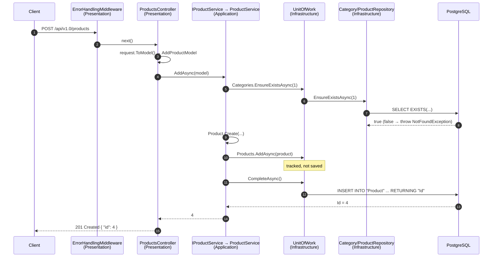
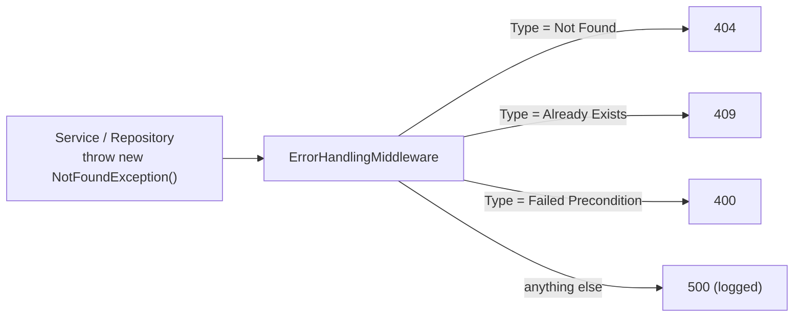

# 4. Putting It Together

## One request through every layer
`POST /api/v1.0/products` with `{ "name": "Keyboard", "price": 49.99, "stock": 100, "categoryId": 1 }`



## Who does what
| Piece | Pattern | Responsibility |
|---|---|---|
| `Product`, `Category` (`: IEntity`) | Clean Architecture: **Domain** | State + rules; created via `Create()`, changed via methods |
| `NotFoundException`, … (`IProblemDetailsProvider`) | Clean Architecture: **Domain** | Describe errors without knowing HTTP |
| `IProductService` → `ProductService` | Clean Architecture: **Application** | Business flow: check, create, decide |
| `IRepository<T>` → `Repository<T>` | **Repository** | Shared CRUD for every `IEntity` |
| `IProductRepository` → `ProductRepository` | **Repository** | *How* to read/stage one entity type |
| `IUnitOfWork` → `UnitOfWork` | **Unit of Work** | Group repositories; `CompleteAsync` / `Transaction` |
| `AppDbContext` + `Configurations/` | Infrastructure | EF Core ↔ PostgreSQL mapping |
| `ProductsController : BaseController` | Clean Architecture: **Presentation** | HTTP ↔ service, nothing else |
| `Program.cs` | Composition root | `RegisterPresentation` → `RegisterApplication` → `RegisterInfrastructure` |

## Errors

Domain exceptions describe themselves through `GetProblemDetails()`. Only Presentation turns them into status codes. Full walkthrough: [5. Error Handling](05-error-handling.md).

```json
{ "status": 404, "title": "Category 99 not found.", "type": "Not Found", "detail": null, "extensions": {} }
```

## Folder map
```
Shop.Demo/
├── global.json  Directory.Build.props  docker-compose.yml
├── Shop.Domain/
│   ├── Entities/                       IEntity, Product, Category
│   └── Exceptions/                     NotFound, AlreadyExists, FailedPrecondition
│       └── Abstraction/                IProblemDetailsProvider, ServiceProblemDetails
├── Shop.Application/
│   ├── Abstracts/                      IRepository<T>, IUnitOfWork
│   │   ├── Repositories/               IProductRepository, ICategoryRepository
│   │   └── Services/                   IProductService, ICategoryService
│   ├── Services/                       ProductService, CategoryService
│   ├── Models/                         ProductModels, CategoryModels
│   └── Extensions/                     RegistrationExtensions, MapperExtensions
├── Shop.Infrastructure/
│   ├── Persistence/                    AppDbContext, DbInitializer
│   │   └── Configurations/             ProductConfiguration, CategoryConfiguration
│   ├── Repositories/                   Repository<T>, ProductRepository, CategoryRepository, UnitOfWork
│   └── Extensions/                     RegistrationExtensions
└── Shop.Presentation/
    ├── Controllers/                    BaseController, ProductsController, CategoriesController
    ├── Models/Requests/                ProductRequests, CategoryRequests
    ├── Extensions/                     RegistrationExtensions, Mapper/MapperExtensions
    ├── Middleware/                     ErrorHandlingMiddleware
    ├── Program.cs
    └── Shop.Presentation.http          ready-to-run requests
```

---
[← 3. Clean Architecture](03-clean-architecture.md) · [Next: 5. Error Handling →](05-error-handling.md)
