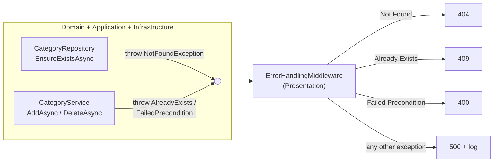
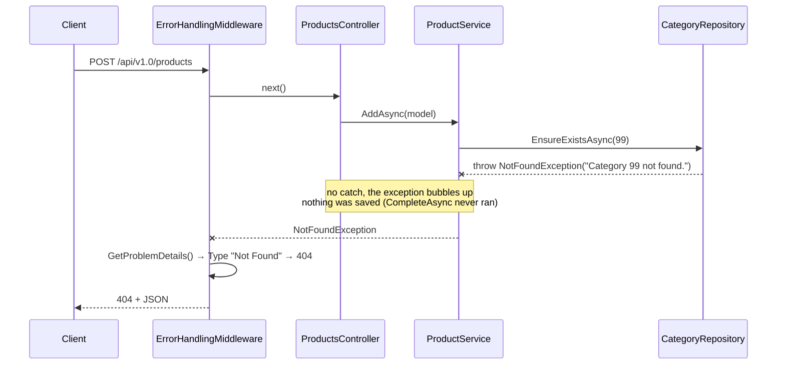
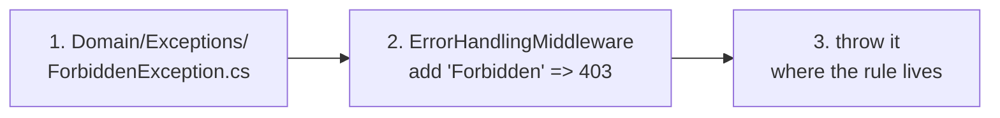

# 5. Error Handling

## Definition
**Throw where the rule lives, translate to HTTP in one place.**
Inner layers throw **Domain exceptions** that describe themselves (`IProblemDetailsProvider`).
One middleware in Presentation catches them and turns them into status codes and JSON.
No `try/catch` in services, no `return NotFound()` in controllers.



## Example

### 1. The contract (`Shop.Domain/Exceptions/Abstraction/`)
```csharp
public interface IProblemDetailsProvider
{
    ServiceProblemDetails GetProblemDetails();
}

public class ServiceProblemDetails
{
    public required string Title { get; init; }     // human message
    public string? Detail { get; init; }
    public required string Type { get; init; }      // error category → status code
    public string? Instance { get; init; }
    public IDictionary<string, object?> Extensions { get; init; }
        = new Dictionary<string, object?>(StringComparer.Ordinal);
}
```

### 2. The exceptions (`Shop.Domain/Exceptions/`)
They live in **Domain**, so every layer can throw them and none of them knows about HTTP.
```csharp
public class NotFoundException(string message) : Exception(message), IProblemDetailsProvider
{
    public ServiceProblemDetails GetProblemDetails() => new()
    {
        Title = Message,
        Type = "Not Found"
    };
}
// AlreadyExistsException      → Type = "Already Exists"
// FailedPreconditionException → Type = "Failed Precondition"
```

| Exception | Meaning | Thrown in Shop.Demo by |
|---|---|---|
| `NotFoundException` | The thing asked for doesn't exist | `ProductService.GetByIdAsync/UpdateAsync/DeleteAsync`, `CategoryRepository.EnsureExistsAsync` |
| `AlreadyExistsException` | Would create a duplicate | `CategoryService.AddAsync` (same name) |
| `FailedPreconditionException` | Request is valid, but the current state forbids it | `CategoryService.DeleteAsync` (has products, or `moveTo` = itself) |

### 3. Throwing: services stay linear
```csharp
// Shop.Application/Services/CategoryService.cs
public async Task<int> AddAsync(AddCategoryModel model, CancellationToken cancellationToken)
{
    var nameExists = await unitOfWork.Categories.NameExistsAsync(model.Name, cancellationToken);

    if (nameExists)
        throw new AlreadyExistsException($"Category '{model.Name}' already exists.");

    var category = Category.Create(model.Name);
    ...
}

// Shop.Application/Services/ProductService.cs: "load or throw" in one expression
var product = await unitOfWork.Products.GetByIdAsync(model.Id, cancellationToken)
    ?? throw new NotFoundException($"Product {model.Id} not found.");
```

Reusable checks throw from the repository, so every caller gets the same error:
```csharp
// Shop.Infrastructure/Repositories/CategoryRepository.cs
public async Task EnsureExistsAsync(int id, CancellationToken cancellationToken)
{
    var exists = await ExistsByIdAsync(id, cancellationToken);

    if (!exists)
        throw new NotFoundException($"Category {id} not found.");
}
```

### 4. Catching: one middleware (`Shop.Presentation/Middleware/ErrorHandlingMiddleware.cs`)
```csharp
public class ErrorHandlingMiddleware(RequestDelegate next, ILogger<ErrorHandlingMiddleware> logger)
{
    public async Task InvokeAsync(HttpContext context)
    {
        try
        {
            await next(context);
        }
        catch (Exception ex) when (ex is IProblemDetailsProvider provider)   // expected errors
        {
            await WriteError(context, provider.GetProblemDetails());
        }
        catch (Exception ex)                                                // bugs, DB down, …
        {
            logger.LogError(ex, "Unhandled exception: {Message}", ex.Message);
            await WriteError(context, new ServiceProblemDetails { Title = "Unexpected error.", Type = "Internal Server Error" });
        }
    }

    private static Task WriteError(HttpContext context, ServiceProblemDetails problem)
    {
        var status = problem.Type switch
        {
            "Not Found" => StatusCodes.Status404NotFound,
            "Already Exists" => StatusCodes.Status409Conflict,
            "Failed Precondition" => StatusCodes.Status400BadRequest,
            _ => StatusCodes.Status500InternalServerError
        };

        context.Response.StatusCode = status;
        return context.Response.WriteAsJsonAsync(new { status, title = problem.Title, type = problem.Type, detail = problem.Detail, extensions = problem.Extensions });
    }
}
```

Registered **first** in `Program.cs`, so it wraps everything after it:
```csharp
app.UseMiddleware<ErrorHandlingMiddleware>();
app.MapControllers();
```

### 5. One failing request, end to end
`POST /api/v1.0/products` with `"categoryId": 99`



### Real responses (from Shop.Demo)
| Request | Status | Body |
|---|---|---|
| `GET /products/999` | 404 | `{"status":404,"title":"Product 999 not found.","type":"Not Found",…}` |
| `POST /products` with `categoryId: 99` | 404 | `{"status":404,"title":"Category 99 not found.","type":"Not Found",…}` |
| `POST /categories` `"Games"` twice | 409 | `{"status":409,"title":"Category 'Games' already exists.","type":"Already Exists",…}` |
| `DELETE /categories/1` (has products) | 400 | `{"status":400,"title":"Category 1 has 3 products. Pass ?moveTo=<categoryId> to move them first.","type":"Failed Precondition",…}` |
| `DELETE /categories/1?moveTo=1` | 400 | `{"status":400,"title":"Cannot move products to the category being deleted.","type":"Failed Precondition",…}` |
| Database down | 500 | `{"status":500,"title":"Unexpected error.","type":"Internal Server Error",…}`, with the real error only in the log |

### Errors inside a transaction
An exception inside `unitOfWork.Transaction(...)` rolls back first, then keeps bubbling to the middleware:
```csharp
await unitOfWork.Transaction(async () =>
{
    ...; await unitOfWork.CompleteAsync(cancellationToken);   // UPDATE "Product"
    ...; await unitOfWork.CompleteAsync(cancellationToken);   // DELETE fails
}, cancellationToken);
// UnitOfWork: catch → RollbackAsync() → throw   ⇒   UPDATE undone   ⇒   middleware → 500
```

## How to add a new error type
Example: `ForbiddenException` → **403**.



**1. Domain**: the exception.
```csharp
public class ForbiddenException(string message) : Exception(message), IProblemDetailsProvider
{
    public ServiceProblemDetails GetProblemDetails() => new() { Title = Message, Type = "Forbidden" };
}
```
**2. Presentation**: one line in the `switch`.
```csharp
"Forbidden" => StatusCodes.Status403Forbidden,
```
**3. Application**: throw it.
```csharp
if (!isOwner)
    throw new ForbiddenException("You can only edit your own products.");
```
No controller changes. Every endpoint gets the new error for free.

### Field errors: use `Extensions`
For validation with several field messages, put them in `Extensions` (as the template's `InvalidArguementException` does):
```csharp
public class InvalidArguementException(List<(string Field, string Error)> errors) : Exception, IProblemDetailsProvider
{
    public ServiceProblemDetails GetProblemDetails() => new()
    {
        Title = "Validation failed.",
        Type = "Invalid Arguement",
        Extensions = errors.ToDictionary(x => x.Field, x => (object?)x.Error)
    };
}
// → 400 { "type": "Invalid Arguement", "extensions": { "Price": "Must be > 0", "Name": "Required" } }
```

### Database errors: translate in Infrastructure
`NameExistsAsync` runs before the insert, but two requests at the same moment can both pass it. The unique index then throws `DbUpdateException`, which becomes a **500**.
Translate it where the database is known, so Presentation never references Npgsql:
```csharp
// Shop.Infrastructure/Repositories/UnitOfWork.cs (possible extension)
public async Task CompleteAsync(CancellationToken cancellationToken)
{
    try
    {
        await dbContext.SaveChangesAsync(cancellationToken);
    }
    catch (DbUpdateException ex) when (ex.InnerException is PostgresException { SqlState: PostgresErrorCodes.UniqueViolation })
    {
        throw new AlreadyExistsException("A record with the same unique value already exists.");   // → 409
    }
}
```

## Benefits
| Benefit | Concrete case in Shop.Demo |
|---|---|
| One place for HTTP mapping | Changing "Already Exists" from 409 to 400 = 1 line in the middleware. 0 controllers touched. |
| Linear services | `?? throw new NotFoundException(...)`, with no `if (x == null) return null;` chains passed up through every layer. |
| Same error everywhere | `EnsureExistsAsync` gives the identical `"Category 99 not found."` from add, update and delete-with-move. |
| Consistent JSON | Every error has the same shape `{ status, title, type, detail, extensions }`, so clients parse one format. |
| Safe 500s | Unknown exceptions are logged with the stack trace, and the client only sees `"Unexpected error."`. |
| No partial writes | Throwing before `CompleteAsync` means nothing is saved. Throwing inside `Transaction` rolls back. |

## Anti-patterns

| # | Anti-pattern | Symptom |
|---|---|---|
| 1 | `try/catch` in every controller | Same mapping copy-pasted 10× and drifting |
| 2 | Returning `null` / `bool` for errors | Callers forget to check → `NullReferenceException` later |
| 3 | HTTP types in services | Service unusable outside ASP.NET |
| 4 | Sending `ex.Message` / stack trace to the client | Leaks SQL, table names, file paths |
| 5 | Swallowing exceptions | Request "succeeds", data never saved |
| 6 | Generic `throw new Exception("...")` | Everything becomes a 500 |
| 7 | Exceptions for normal flow | Using try/catch as an `if` |

### 1. `try/catch` in every controller
```csharp
// ❌
[HttpGet("{id:int}")]
public async Task<IActionResult> GetById(int id)
{
    try { return Ok(await productService.GetByIdAsync(id, ct)); }
    catch (NotFoundException e) { return NotFound(e.Message); }
    catch (Exception) { return StatusCode(500); }
}
```
```csharp
// ✅ Shop.Demo: the middleware handles it
public async Task<ActionResult<ProductModel>> GetById(int id, CancellationToken cancellationToken) =>
    Ok(await productService.GetByIdAsync(id, cancellationToken));
```

### 2. Returning `null` / `bool` for errors
```csharp
// ❌ Every caller must remember the check, and the reason is lost
public async Task<ProductModel?> GetByIdAsync(int id) => product?.ToModel();
public async Task<bool> DeleteAsync(int id) { if (product is null) return false; ... }
```
✅ `?? throw new NotFoundException($"Product {id} not found.")`: the error carries its reason and can't be ignored.

### 3. HTTP types in services
```csharp
// ❌ Application now depends on ASP.NET Core
throw new HttpRequestException("Not found", null, HttpStatusCode.NotFound);
return new NotFoundObjectResult("...");
```
✅ Throw a Domain exception. Only the middleware knows status codes.

### 4. Leaking internals
```csharp
// ❌ Client sees: "23505: duplicate key value violates unique constraint \"IX_Category_Name\""
catch (Exception ex) { await context.Response.WriteAsJsonAsync(new { error = ex.ToString() }); }
```
✅ Log `ex` server-side, and return `"Unexpected error."` for anything that isn't an `IProblemDetailsProvider`.

### 5. Swallowing exceptions
```csharp
// ❌ Returns 204, but the category was never deleted
try { await unitOfWork.CompleteAsync(ct); } catch { }
```
✅ Let it bubble. If you catch, **rethrow** or translate (`throw new AlreadyExistsException(...)`).

### 6. Generic `Exception`
```csharp
// ❌ Becomes 500 "Unexpected error.", and the client can't tell it was their mistake
throw new Exception("Category already exists");
```
✅ Pick the type that says **why**: `AlreadyExistsException` → 409.

### 7. Exceptions as control flow
```csharp
// ❌ Throw + catch just to choose a branch
try { await unitOfWork.Categories.EnsureExistsAsync(id, ct); create(); }
catch (NotFoundException) { createCategoryFirst(); }
```
✅ When "missing" is a normal case, ask a question instead: `var exists = await unitOfWork.Categories.ExistsByIdAsync(id, ct); if (!exists) ...`.
Throw only when the request **can't** continue.

---
[← 4. Putting It Together](04-putting-it-together.md) · [Back to README](../README.md)
